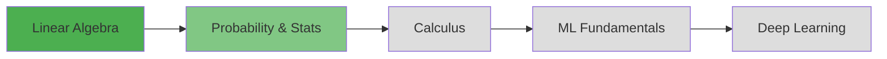

<div align="center">

# Deep ML Practice

### _Building ML Foundations, One Problem at a Time_

[](https://www.python.org/)
[](https://numpy.org/)
[](LICENSE)

_A curated journey through Mathematics, Machine Learning, and AI fundamentals_

[Getting Started](#-quick-start) • [Progress](#-daily-progress) • [Roadmap](#-learning-roadmap)

</div>

---

## Mission

This repository chronicles my daily expedition into the mathematical foundations of Machine Learning. Each solution is crafted with clarity, documented with purpose, and designed to build intuition from first principles.

> **Daily Commitment:** 1–2 problems from [Deep ML](https://www.deep-ml.com/collections)  
> **Focus Areas:** Linear Algebra → Calculus → Statistics → ML → Deep Learning

---

## Repository Structure

```
DEEP_ML/
│
├── 📁 1. Linear Algebra/
│   ├── 1_Matrix-Vector-Dot-Product.py    # Foundation: Vector operations
│   ├── 2_Transpose-Matrix.py              # Matrix manipulations
│   ├── 3_Dot_Product.py                   # Dot product computation
│   ├── 4_Scalar_multiplication.py         # Scalar operations
│   ├── 5_Cosine.py                        # Cosine similarity
│   ├── 6_Calculate_Mean.py                # Mean by row/column
│   ├── 7_Eigenvalues.py                   # Eigenvalue computation
│   ├── 8_Matrix_Inverse.py                # Matrix inversion
│   └── 9_Matrix_times_Matrix.py           # Matrix multiplication
│
├── 📁 2. Probability and Statistics/
│   └── 1_Poisson.py                       # Poisson distribution
│
├── 🐍 venv/                                # Isolated environment
├── 📋 requirements.txt                     # Dependencies
└── 📖 README.md                            # You are here
```

---

## ⚡ Quick Start

```bash
# Clone the repository
git clone <your-repo-url>
cd DEEP_ML

# Set up virtual environment
python -m venv venv
source venv/bin/activate  # On Windows: venv\Scripts\activate

# Install dependencies
pip install -r requirements.txt

# Run any solution
python "1. Linear Algebra/1_Matrix-Vector-Dot-Product.py"
```

---

## What's Inside

Each solution includes:

-   **Crystal-clear problem statements**
-   **Step-by-step implementation**
-   **Both NumPy and pure Python approaches** (when applicable)
-   **Intuitive explanations and edge case handling**
-   **Test cases and validation**

---

<table>
<tr>
<td width="50%">

**Matrix Multiplication**

```python
# Multiply two matrices using NumPy
# Implements the dot product of matrices
# Validates dimensions for matrix multiplication
# Supports any compatible matrix sizes
# Returns the resulting matrix product
```

</td>
<td width="50%">

**Poisson Distribution**

```python
# Calculate Poisson probability distribution
# Models discrete events occurring over fixed intervals
# Implements the Poisson PMF formula
# Useful for counting rare events
# Returns probability of k events occurring
```

</td>
</tr>
</table>

---

## 📈 Daily Progress

<div align="center">

| 📅 Date          | 🎯 Completed                                   | 📝 Category                  | 💭 Reflection                                      |
| ---------------- | ---------------------------------------------- | ---------------------------- | -------------------------------------------------- |
| **Nov 10, 2025** | Matrix-Vector Dot Product<br/>Transpose Matrix | Linear Algebra               | Mastered fundamental matrix operations             |
| **Nov 11, 2025** | Dot_product<br/>Scalar_Multiplication          | Linear Algebra               | Mastered fundamental matrix multiplication         |
| **Nov 12, 2025** | Cosine<br/>Calculate Mean by Row or Column     | Linear Algebra               | Explored similarity metrics and statistical basics |
| **Nov 13, 2025** | Eigenvalues<br/>Matrix Inverse                 | Linear Algebra               | Advanced linear algebra concepts                   |
| **Nov 14, 2025** | Matrix times Matrix<br/>Poisson Distribution   | Linear Algebra & Probability | Bridging algebra and statistics                    |

**Current Streak:** 5 days 🔥 | **Total Problems:** 10 ✅

</div>

---

## 🗺️ Learning Roadmap



### 🎯 Upcoming Topics

<details>
<summary><b>Phase 1: Linear Algebra Mastery</b></summary>

-   [x] Matrix Determinants
-   [x] Matrix Inverses
-   [x] Matrix Multiplication
-   [x] Eigenvalues & Eigenvectors
-   [ ] Singular Value Decomposition (SVD)
-   [ ] Principal Component Analysis (PCA)

</details>

<details>
<summary><b>Phase 2: Probability & Statistics</b></summary>

-   [x] Poisson Distribution
-   [ ] Normal Distribution
-   [ ] Probability Distributions
-   [ ] Maximum Likelihood Estimation
-   [ ] Hypothesis Testing
-   [ ] Bayesian Inference

</details>

<details>
<summary><b>Phase 3: Calculus Deep Dive</b></summary>

-   [ ] Gradient Descent Fundamentals
-   [ ] Partial Derivatives
-   [ ] Chain Rule Applications
-   [ ] Backpropagation Mathematics

</details>

<details>
<summary><b>Phase 4: Machine Learning Algorithms</b></summary>

-   [ ] Linear Regression from Scratch
-   [ ] Logistic Regression
-   [ ] Neural Network Basics
-   [ ] Loss Functions & Optimizers

</details>

---

## 💻 Code Philosophy

> **Clean** • **Documented** • **Testable** • **Educational**

```python
# Every solution follows these principles:
def solve_problem(input_data):
    """
    Clear docstring explaining the approach

    Args:
        input_data: What goes in

    Returns:
        output: What comes out
    """
    # Step-by-step implementation
    # with explanatory comments
    pass
```

-   PEP8 compliant
-   Type hints where helpful
-   Self-contained and executable
-   Optimized for learning, not just performance

---

## 🤝 Connect & Contribute

<div align="center">

**Crafted with 💙 by Roushan Kumar**

[](https://github.com/rkuma18)
[](https://www.linkedin.com/in/rk0718/)

**Learning Resources**  
[Deep ML Collections](https://www.deep-ml.com/collections) • [Python Docs](https://docs.python.org/) • [NumPy Guide](https://numpy.org/doc/)

---

_"The only way to learn mathematics is to do mathematics." — Paul Halmos_

**Star ⭐ this repo if you find it helpful!**

</div>
